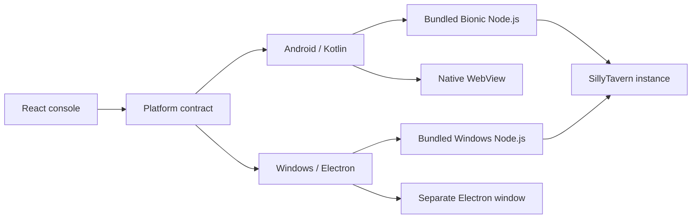

  

<h1 align="center">SillyClient</h1>

A SillyTavern instance manager for Android and Windows

  <a href="./README.md"><kbd>简体中文</kbd></a>
  <a href="./README.en.md"><kbd>English</kbd></a>

  <a href="https://captchaaaaa.github.io/SillyClient/">Project site</a>
  ·
  <a href="https://github.com/CAPTCHAAAAA/SillyClient/releases">Downloads</a>
  ·
  <a href="https://github.com/CAPTCHAAAAA/SillyClient-Android">Android source</a>
  ·
  <a href="https://github.com/CAPTCHAAAAA/SillyClient-Windows">Windows source</a>

SillyClient installs, runs, and manages SillyTavern instances. It can create an instance from a GitHub release or a local archive, or register an existing remote server. Downloads, setup progress, ports, configuration, and runtime logs are managed from one console.

The Android package includes an arm64 Bionic build of Node.js. The Windows package includes a fixed Windows x64 build of Node.js. At runtime, SillyClient does not require Termux or use Node.js from the system `PATH`.

## Scope

SillyClient is not a fork of SillyTavern. It does not provide models, API services, accounts, or access credentials. For a local instance, the client retrieves the selected SillyTavern version and prepares its runtime on the device. A remote instance stores only the address of an existing service and does not install another local copy.

Installers are published on the main repository's [Releases](https://github.com/CAPTCHAAAAA/SillyClient/releases) page.

## Features

- Create SillyTavern instances from GitHub releases or local zip archives
- Report download, extraction, and dependency installation progress, then verify that an instance can run before marking setup as complete
- Manage multiple local instances and connect to existing remote SillyTavern services
- Configure ports and instance settings, with access to runtime logs and terminal output
- Import, export, and remove instance data
- Move between the management console and the SillyTavern reader without interrupting the background service

## Runtime architecture

The shared React console presents instance configuration, state, and logs. Platform code owns the file system, downloads, archive extraction, process lifecycle, port checks, and window management.

The management console and SillyTavern run in separate windows. Closing the reader returns to the console without stopping the instance; stopping an instance is an explicit console action. Android uses two native WebViews and handles immersive display, `DisplayCutout`, and vendor-specific window behavior. On Windows, Electron manages the separate application window and bundled runtime.

## Supported platforms

| Platform | Implementation | Requirements |
| --- | --- | --- |
| Android | Kotlin, Capacitor 7, native WebView, arm64 Bionic Node.js | Android 8.0+ (API 26), arm64-v8a |
| Windows | Electron 33, TypeScript, Node.js 22.16.0 | Windows 10 or 11, x64 |

## Repositories

SillyClient is maintained in three independent repositories without Git submodules:

| Repository | Responsibility | Default branch |
| --- | --- | --- |
| [SillyClient](https://github.com/CAPTCHAAAAA/SillyClient) | GitHub Pages, public documentation, releases, and installers | `main` |
| [SillyClient-Android](https://github.com/CAPTCHAAAAA/SillyClient-Android) | Shared React console, Kotlin host, and Android runtime | `main` |
| [SillyClient-Windows](https://github.com/CAPTCHAAAAA/SillyClient-Windows) | Electron host, Windows runtime, and installer | `master` |

The only source directory for the shared React console is `web/capacitor-ui/` in the Android repository. The following directories are generated outputs and should not be edited as source:

| Generated directory | Purpose |
| --- | --- |
| Android `app/src/main/assets/public/` | Console bundled in the APK |
| Windows `frontend-dist/` | Electron packaging input |
| Main repository `docs/app/` | Interactive GitHub Pages demo |

The former `SillyClient-Frontend` repository is archived and is no longer part of the build.

## Development documentation

- [Project architecture](./docs/ARCHITECTURE.md)
- [Contributing](./CONTRIBUTING.md)
- [Release process](./release/RELEASE-GUIDE.md)
- [Android build instructions](https://github.com/CAPTCHAAAAA/SillyClient-Android#构建)
- [Windows build instructions](https://github.com/CAPTCHAAAAA/SillyClient-Windows#开发与打包)

## Relationship to SillyTavern

SillyClient is an independently maintained community project and is not endorsed by SillyTavern. The SillyTavern source code, name, and releases are maintained by the [SillyTavern](https://github.com/SillyTavern/SillyTavern) project. Use and redistribution of upstream components remain subject to the upstream license terms.

## License

[MIT](./LICENSE)
