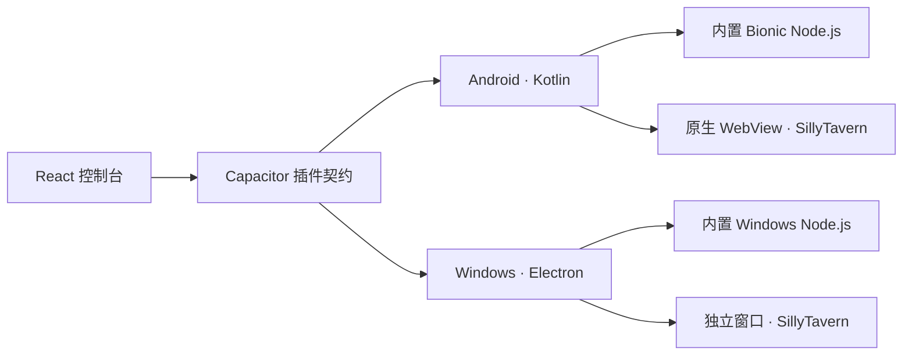

<p align="center">
  
</p>

<h1 align="center">SillyClient</h1>

<p align="center">
  把 SillyTavern 的运行环境、实例管理和阅读窗口装进一个真正的应用。
</p>

<p align="center">
  <a href="https://captchaaaaa.github.io/SillyClient/landing-3d-v2.html">项目主页</a>
  ·
  <a href="https://github.com/CAPTCHAAAAA/SillyClient/releases">下载</a>
  ·
  <a href="https://github.com/CAPTCHAAAAA/SillyClient-Android">Android</a>
  ·
  <a href="https://github.com/CAPTCHAAAAA/SillyClient-Windows">Windows</a>
</p>

SillyClient 不是 SillyTavern 的分支，也不提供模型或 API。它负责另一件更具体的事：在 Android 和 Windows 上准备 Node.js 运行时，安装并启动你的 SillyTavern，再用适合当前平台的窗口把它打开。

换句话说，SillyTavern 仍然是 SillyTavern；SillyClient 负责让它更容易落地、保持运行，并在需要时回到它。

## 它解决什么

在 Android 上运行 SillyTavern，通常意味着先准备终端环境，再处理 Node.js、依赖、端口和后台进程。Windows 的步骤少一些，但版本、实例目录和运行状态依旧容易散落。

SillyClient 把这些事情收进同一个控制台：

- 创建和切换本地实例，也可以连接远程 SillyTavern
- 从 GitHub Release 或本地 zip 安装版本
- 为每个实例管理端口、配置、数据目录和运行状态
- 启动、返回、停止实例，查看实时日志与终端输出
- 导入、导出和清理实例数据
- 让运行时随应用提供，用户无需另装 Termux 或 Node.js

## 两个界面，各自负责

SillyClient 没有把管理器和 SillyTavern 硬塞进同一个网页容器。

控制台由共享的 React 前端提供，用来管理实例；真正的 SillyTavern 则由平台侧的独立窗口承载。这样，返回控制台不会顺手停止酒馆，沉浸式、刘海区域、窗口叠加和系统手势也可以由原生层处理。



Android 端还针对移动阅读做了额外处理：酒馆与控制台使用两个 WebView，顶部区域通过 PixelCopy 跟随页面取色，并适配沉浸式、DisplayCutout 以及 MIUI / HyperOS 的窗口行为。

## 平台

| 平台 | 当前实现 | 系统要求 |
| --- | --- | --- |
| Android | Kotlin + Capacitor 7，内置 arm64 Bionic Node.js | Android 8.0+（API 26），arm64-v8a |
| Windows | Electron 33 + TypeScript，内置 Node.js 22 | Windows 10 / 11，x64 |

安装包统一放在 [GitHub Releases](https://github.com/CAPTCHAAAAA/SillyClient/releases)。Android 首次创建本地实例时需要下载 SillyTavern 源码与依赖；使用远程实例则直接连接已有地址。

## 仓库

这个仓库是项目入口、文档、GitHub Pages 与 Release 索引。平台实现分别维护：

| 仓库 | 内容 |
| --- | --- |
| [SillyClient-Android](https://github.com/CAPTCHAAAAA/SillyClient-Android) | Kotlin 宿主、Android 运行时、原生 WebView 与系统适配 |
| [SillyClient-Windows](https://github.com/CAPTCHAAAAA/SillyClient-Windows) | Electron 宿主、Windows 运行时与窗口管理 |
| [SillyClient-Frontend](https://github.com/CAPTCHAAAAA/SillyClient-Frontend) | 两个平台共享的 React 控制台与插件接口 |

克隆入口仓库及其子模块：

```bash
git clone --recurse-submodules https://github.com/CAPTCHAAAAA/SillyClient.git
```

具体构建环境和命令以各平台仓库中的 README 为准。主仓库本身不复制平台源码，避免发布页和实现仓库出现两套不同步的版本。

## 与 SillyTavern 的关系

SillyClient 是独立的社区项目。SillyTavern 的名称、源码与上游发布归 [SillyTavern](https://github.com/SillyTavern/SillyTavern) 项目所有；使用前请同时阅读上游项目的许可和说明。

## English

SillyClient packages the runtime, instance lifecycle and native reading window needed to run your own SillyTavern on Android and Windows. It is not a SillyTavern fork and does not include models or API access. See [Releases](https://github.com/CAPTCHAAAAA/SillyClient/releases) for installers and the platform repositories above for source and build instructions.

## License

[MIT](./LICENSE)
