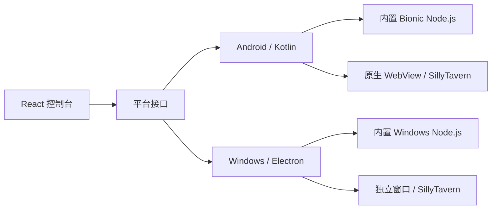

<p align="center">
  
</p>

<h1 align="center">SillyClient</h1>

<p align="center">
  Android 和 Windows 上的 SillyTavern 启动器
</p>

<p align="center">
  <a href="https://captchaaaaa.github.io/SillyClient/landing-3d-v2.html">项目主页</a>
  ·
  <a href="https://github.com/CAPTCHAAAAA/SillyClient/releases">下载</a>
  ·
  <a href="https://github.com/CAPTCHAAAAA/SillyClient-Android">Android</a>
  ·
  <a href="https://github.com/CAPTCHAAAAA/SillyClient-Windows">Windows</a>
</p>

SillyClient 安装并运行你自己的 SillyTavern。Android 版本包含 Bionic Node.js，Windows 版本包含 Node.js 22。本地实例、远程地址、端口和日志都放在同一个控制台里。

它不是 SillyTavern 的分支，也不包含模型或 API。安装包在 [GitHub Releases](https://github.com/CAPTCHAAAAA/SillyClient/releases)。

## 能做什么

- 从 GitHub Release 或本地 zip 创建 SillyTavern 实例
- 显示下载和安装进度，完成后再检查实例能否启动
- 管理多个本地实例，也可以添加已有的远程 SillyTavern 地址
- 修改端口和配置，查看运行日志与终端输出
- 导入、导出或清理实例数据

## 为什么分成两个窗口

控制台用于安装和管理实例。SillyTavern 在另一个窗口中打开。

关掉阅读窗口不会停止服务，返回控制台也不会打断正在运行的会话。需要停止实例时，在控制台操作。Android 的沉浸式显示、刘海区域和系统手势，以及 Windows 的窗口管理，也都留给平台端处理。



Android 端使用两个 WebView 分开承载控制台和 SillyTavern。顶部区域通过 PixelCopy 跟随页面取色，并适配沉浸式、DisplayCutout 及 MIUI / HyperOS 的窗口行为。

## 平台

| 平台 | 当前实现 | 系统要求 |
| --- | --- | --- |
| Android | Kotlin + Capacitor 7，内置 arm64 Bionic Node.js | Android 8.0+（API 26），arm64-v8a |
| Windows | Electron 33 + TypeScript，内置 Node.js 22 | Windows 10 / 11，x64 |

创建本地实例时，SillyClient 会下载所选版本和依赖。远程实例只保存已有服务的地址，不会在本机重复安装。

## 仓库

这个仓库保存项目文档、GitHub Pages 和 Release 索引。平台代码分别维护：

| 仓库 | 内容 |
| --- | --- |
| [SillyClient-Android](https://github.com/CAPTCHAAAAA/SillyClient-Android) | Kotlin 宿主、Android 运行时、原生 WebView 与系统适配 |
| [SillyClient-Windows](https://github.com/CAPTCHAAAAA/SillyClient-Windows) | Electron 宿主、Windows 运行时与窗口管理 |

共用的 React 控制台源码位于 Android 仓库的 `App/web/capacitor-ui/`。构建产物会同步到 Android assets、Windows `frontend-dist/` 和本仓库 `docs/app/`。旧 `SillyClient-Frontend` 仓库已归档，不再参与构建。

三个仓库彼此独立。只做网站或发版时克隆主仓库；开发客户端时再克隆对应平台仓库：

```bash
git clone https://github.com/CAPTCHAAAAA/SillyClient.git
git clone https://github.com/CAPTCHAAAAA/SillyClient-Android.git
git clone https://github.com/CAPTCHAAAAA/SillyClient-Windows.git
```

构建环境和命令以各平台仓库的 README 为准。仓库边界、前端同步和发版约定见 [架构说明](./docs/ARCHITECTURE.md) 与 [贡献指南](./CONTRIBUTING.md)。

## 与 SillyTavern 的关系

SillyClient 是独立的社区项目，没有得到 SillyTavern 官方背书。SillyTavern 的名称、源码和发布由 [SillyTavern](https://github.com/SillyTavern/SillyTavern) 项目维护。使用时请同时遵守上游许可。

## English

SillyClient installs and runs your own SillyTavern on Android and Windows. Node.js is included with the app. The console manages local instances, remote server addresses, ports, setup progress, and logs.

SillyClient is an independent community project. It is not a SillyTavern fork, does not include models or API access, and is not endorsed by the SillyTavern project. Download installers from [Releases](https://github.com/CAPTCHAAAAA/SillyClient/releases).

## License

[MIT](./LICENSE)
