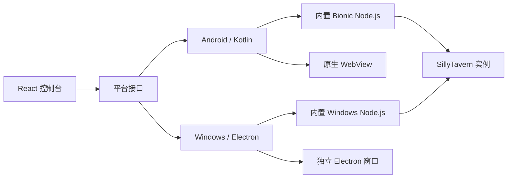

  

<h1 align="center">SillyClient</h1>

面向 Android 与 Windows 的 SillyTavern 实例管理客户端

  <a href="./README.md"><kbd>简体中文</kbd></a>
  <a href="./README.en.md"><kbd>English</kbd></a>

  <a href="https://captchaaaaa.github.io/SillyClient/">项目主页</a>
  ·
  <a href="https://github.com/CAPTCHAAAAA/SillyClient/releases">下载安装包</a>
  ·
  <a href="https://github.com/CAPTCHAAAAA/SillyClient-Android">Android 源码</a>
  ·
  <a href="https://github.com/CAPTCHAAAAA/SillyClient-Windows">Windows 源码</a>

SillyClient 用于安装、运行和管理 SillyTavern 实例。客户端可从 GitHub Release 或本地压缩包创建实例，也可登记已有的远程服务地址。下载、安装、端口、配置与运行日志统一由控制台管理。

Android 安装包内置 arm64 Bionic Node.js；Windows 安装包内置固定版本的 Windows x64 Node.js。客户端运行时不依赖 Termux，也不读取系统 `PATH` 中的 Node.js。

## 项目边界

SillyClient 不是 SillyTavern 的分支，不提供模型、API 服务、账户或访问凭据。创建本地实例时，客户端获取用户指定的 SillyTavern 版本并在设备上准备运行环境；远程实例仅保存服务地址，不会在本机重复安装。

安装包统一发布在主仓库的 [Releases](https://github.com/CAPTCHAAAAA/SillyClient/releases) 页面。

## 功能

- 从 GitHub Release 或本地 zip 创建 SillyTavern 实例
- 显示下载、解压和依赖安装进度，通过可运行性检查后再完成创建
- 管理多个本地实例，并连接已有的远程 SillyTavern 服务
- 设置端口与实例配置，查看运行日志和终端输出
- 导入、导出和清理实例数据
- 在控制台与 SillyTavern 阅读窗口之间切换，不中断后台服务

## 运行结构

React 控制台负责实例配置、状态和日志展示。平台层负责文件系统、下载、解压、进程生命周期、端口检测和窗口管理。

控制台和 SillyTavern 使用不同窗口。关闭阅读窗口只会返回控制台，不会停止实例；停止操作由控制台显式执行。Android 使用两个原生 WebView，并处理沉浸式显示、DisplayCutout 与厂商窗口行为。Windows 由 Electron 管理独立窗口和内置运行时。

## 平台支持

| 平台 | 实现 | 系统要求 |
| --- | --- | --- |
| Android | Kotlin、Capacitor 7、原生 WebView、arm64 Bionic Node.js | Android 8.0+（API 26），arm64-v8a |
| Windows | Electron 33、TypeScript、Node.js 22.16.0 | Windows 10 / 11，x64 |

## 仓库结构

SillyClient 由三个独立仓库组成，不使用 Git submodule：

| 仓库 | 职责 | 默认分支 |
| --- | --- | --- |
| [SillyClient](https://github.com/CAPTCHAAAAA/SillyClient) | GitHub Pages、公共文档、Release 与安装包 | `main` |
| [SillyClient-Android](https://github.com/CAPTCHAAAAA/SillyClient-Android) | 共享 React 控制台、Kotlin 宿主和 Android 运行时 | `main` |
| [SillyClient-Windows](https://github.com/CAPTCHAAAAA/SillyClient-Windows) | Electron 宿主、Windows 运行时和安装器 | `master` |

共享 React 控制台的唯一源码位于 Android 仓库的 `web/capacitor-ui/`。以下目录是构建产物，不作为功能修改入口：

| 生成目录 | 用途 |
| --- | --- |
| Android `app/src/main/assets/public/` | APK 内置控制台 |
| Windows `frontend-dist/` | Electron 打包输入 |
| 主仓库 `docs/app/` | GitHub Pages 交互演示 |

旧 `SillyClient-Frontend` 仓库已经归档，不再参与构建。

## 开发文档

- [项目架构](./docs/ARCHITECTURE.md)
- [参与开发](./CONTRIBUTING.md)
- [发布流程](./release/RELEASE-GUIDE.md)
- [Android 构建说明](https://github.com/CAPTCHAAAAA/SillyClient-Android#构建)
- [Windows 构建说明](https://github.com/CAPTCHAAAAA/SillyClient-Windows#开发与打包)

## 与 SillyTavern 的关系

SillyClient 是独立维护的社区项目，未获得 SillyTavern 官方背书。SillyTavern 的源码、名称和发布由 [SillyTavern](https://github.com/SillyTavern/SillyTavern) 项目维护。使用或分发相关组件时，应同时遵守上游项目的许可条款。

## 许可证

[MIT](./LICENSE)
