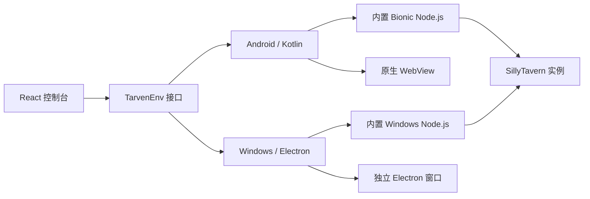

# 项目架构

SillyClient 用一套 React 控制台管理 Android 和 Windows 上的 SillyTavern 实例。界面共用，文件、进程、窗口和系统适配由各平台实现。

## 仓库边界

| 仓库 | 负责内容 | 默认分支 |
| --- | --- | --- |
| `SillyClient` | GitHub Pages、公共文档、Release 与安装包 | `main` |
| `SillyClient-Android` | React 控制台唯一源码、Kotlin 宿主、Android 运行时 | `main` |
| `SillyClient-Windows` | Electron 宿主、Windows 运行时与安装器 | `master` |

仓库不通过 Git submodule 互相嵌套。跨仓库关系由版本、同步脚本和 Release 记录表达，避免只有部分平台被子模块追踪。

## 运行结构

控制台负责实例配置和状态展示。平台层负责下载、解压、进程生命周期、端口检测和窗口切换。实例只有通过可运行性检查后才算创建成功。

## 前端产物流向

唯一源码：`SillyClient-Android/App/web/capacitor-ui/`

| 目标 | 用途 | 是否提交 |
| --- | --- | --- |
| Android `app/src/main/assets/public/` | APK 内控制台 | 是 |
| Windows `frontend-dist/` | Electron 打包输入 | 否，可再生 |
| 主仓库 `docs/app/` | GitHub Pages 手机屏幕演示 | 是，Pages 直接使用 |

修改前端后先在 Android 仓库构建，再同步到目标。不要在生成副本上修功能。

## 发布边界

平台仓库不创建 Tag 或 Release。发布版本号、说明、校验值、APK 和 EXE 都进入主仓库 Release。平台提交哈希写入发布记录，安装包由对应提交构建。

关键决策见 [`adr/`](./adr/README.md)。平台内部实现分别以各平台仓库的架构文档为准。
