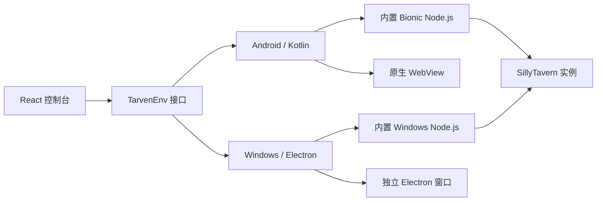

# 项目架构

SillyClient 用一套 React 控制台管理 Android 和 Windows 上的 SillyTavern 实例。界面共用，文件、进程、窗口和系统适配由各平台实现。

## 仓库边界

| 仓库 | 负责内容 | 默认分支 |
| --- | --- | --- |
| `SillyClient` | GitHub Pages、公共文档、Release 与安装包 | `main` |
| `SillyClient-Android` | React 控制台唯一源码、Kotlin 宿主、Android 运行时 | `main` |
| `SillyClient-Windows` | Electron 宿主、Windows 运行时与安装器 | `master` |

仓库不通过 Git submodule 互相嵌套。跨仓库关系由版本、同步脚本和 Release 记录表达，避免只有部分平台被子模块追踪。

## 运行结构

```mermaid
flowchart LR
    UI["React 控制台"] --> Contract["TarvenEnv 接口"]
    Contract --> Android["Android / Kotlin"]
    Contract --> Windows["Windows / Electron"]
    Android --> ANode["内置 Bionic Node.js"]
    Windows --> WNode["内置 Windows Node.js"]
    ANode --> ST["SillyTavern 实例"]
    WNode --> ST
    Android --> AView["原生 WebView"]
    Windows --> WView["独立 Electron 窗口"]
```

控制台负责实例配置和状态展示。平台层负责下载、解压、进程生命周期、端口检测和窗口切换。实例只有通过可运行性检查后才算创建成功。

远程实例支持 HTTP Basic Auth。共享前端只保存用户名等非敏感元数据，密码分别由 Android Keystore 和 Electron `safeStorage` 保管。连接预检、应用内认证挑战和凭据删除都由平台层实现；密码不得进入 URL、日志、Pages 生成物或浏览器存储。系统浏览器模式不会注入凭据。

## 前端产物流向

唯一源码：`SillyClient-Android/web/capacitor-ui/`

| 目标 | 用途 | 是否提交 |
| --- | --- | --- |
| Android `app/src/main/assets/public/` | APK 内控制台 | 是 |
| Windows `frontend-dist/` | Electron 打包输入 | 否，可再生 |
| 主仓库 `docs/app/` | GitHub Pages 设备屏幕演示 | 是，Pages 直接使用 |

修改前端后先在 Android 仓库构建，再同步到目标。不要在生成副本上修功能。

## Pages 宣传页结构

`docs/index.html` 只保留页面语义结构和依赖装配。视觉与运行逻辑按职责拆分：

本节说明模块边界。日常修改入口、依赖方向、产品帧生成和发布验收见
[`PAGES-MAINTENANCE.md`](./PAGES-MAINTENANCE.md)；从 GitHub 浏览 `docs/` 时可先阅读
[`README.md`](./README.md)。

| 模块 | 文件 | 负责内容 |
| --- | --- | --- |
| 产品主题 | `docs/styles/theme.css` | 产品色板、基础材质与全局字体栈 |
| 移动端轻量页 | `docs/mobile.html`、`docs/mobile/styles/`、`docs/mobile/scripts/`、`docs/mobile-frames/` | 复用桌面视觉与三段内容结构，仅将第二页实时 3D 舞台替换为产品帧切换 |
| 产品帧工具 | `docs/product-render/`、`docs/scripts/product-render/` | 集中管理展示尺寸和贴图，从真实前端生成屏幕纹理，并通过 WebGL 导出透明产品帧 |
| 页面骨架 | `docs/styles/page.css`、`docs/styles/page/` | 按基础、旅程、平台、检查器和响应式规则拆分页面样式 |
| 首屏构图 | `docs/styles/hero.css` | 左侧产品介绍、右侧交叉设备摄影画幅与翻页提示 |
| 页面导航 | `docs/styles/navigation.css` | 顶部信息栏与右侧三点页轨 |
| 展示舞台 | `docs/styles/showcase.css`、`docs/scripts/spotlight-card.js` | 双端设备叙事、横向源码卡片轨道与局部光场 |
| 舞台光学 | `docs/styles/optics.css` | 边缘色散与舞台体积边界；设备模型不使用景深或渐进虚化 |
| 项目轮播 | `docs/scripts/platform-carousel.js` | 第三页分镜切换、键盘控制与可访问状态 |
| 文字动效 | `docs/styles/scroll-reveal.css`、`docs/scripts/scroll-reveal.js`、`docs/styles/variable-proximity.css`、`docs/scripts/variable-proximity.js`、`docs/styles/text-type.css`、`docs/scripts/text-type.js` | 翻页主标题、英文邻近字重与源码标签打字效果 |
| 手机外观 | `docs/styles/phone.css` | 屏幕投影层、灵动岛与反射 |
| 电脑外观 | `docs/styles/laptop.css` | 桌面屏幕投影层与反射 |
| 标题字体 | `docs/styles/fonts.css`、`docs/scripts/fonts.js`、`docs/scripts/ui/title-font-controller.js` | 首屏字体资源、轮换列表和桌面/移动共用控制器 |
| 动态背景 | `docs/scripts/background.js`、`docs/scripts/background/` | 分离 Color Bends、Dot Field 与共用运行时 |
| 场景配置 | `docs/scripts/device-scene-config.js` | 保存从资产库 Blender 场景换算出的相机、设备姿态与舞台状态 |
| WebGL 舞台 | `docs/scripts/device-render/webgl-stage.js` | Three.js 场景、环境贴图、摄影灯光、抗锯齿与后处理 |
| 手机模型 | `docs/scripts/device-render/phone-device.js` | 手机 GLB 归一化、材质校准、标志处理与屏幕网格识别 |
| 屏幕投影 | `docs/scripts/device-render/screen-projection.js` | 将真实 HTML 屏幕刚性投影到手机和电脑网格 |
| 输入响应 | `docs/scripts/device-render/input-motion.js` | 桌面鼠标与设备姿态输入 |
| 设备编排 | `docs/scripts/phone-model.js`、`docs/scripts/device-transition.js` | 实时渲染循环、双端站位与镜头转场 |
| 电脑模型 | `docs/scripts/laptop-model.js` | GLB 节点处理、屏幕与键盘网格法线校准、精确垂直铰链与标志隐藏 |
| 双端展示 | `docs/scripts/device-showcase.js` | 第二页折叠项与三种设备站位状态 |
| 页面编排 | `docs/scripts/page.js`、`docs/scripts/page/` | 页面启动、双语文案、组件检查器与分屏导航 |
| 视口路由 | `docs/scripts/viewport-router.js` | 按宽高比选择桌面或移动入口，并保留显式预览参数 |
| 局部动效 | `docs/scripts/effects-runtime.js`、`component-*.js` | 文本、悬浮与组件反馈 |

`SillyClient_Assets/models/blender/模拟场景.blend` 是开屏视角与设备相对姿态的视觉基准。网页不会导出或叠加第二份场景模型；`device-scene-config.js` 只保存坐标系换算后的相机与姿态数据，`phone-model.js` 仍使用原始手机、电脑 GLB 在同一画布中实时渲染。第二页电脑的第一状态保留模型原始铰链角，第二、第三状态根据屏幕与键盘网格法线求解严格垂直角。

颜色和全局排版修改从 `theme.css` 开始；模型、背景或页面布局修改进入对应模块，不在
`index.html` 增加新的内联样式或脚本。`page.js` 和 `phone-model.js` 只负责装配，
具体实现分别进入 `page/`、`device-render/`、`background/` 和
`product-render/`。`scripts/validate-pages.mjs` 会检查模块文件、页面引用和
中英文键的一致性。

页面排版由 `page.css` 中的 `--layout-unit` 控制，桌面内容画布以 16:9 为参考并居中保留稳定留白。文字层级使用独立排版变量，不与 3D 模型尺寸绑定。背景始终覆盖实际视口；Three.js 设备使用居中的固定 16:9 舞台，宽高比变化时通过留白适配，不改变镜头透视。组件尺寸使用 `rem`，全屏背景、滚动容器和页高使用 `vw` / `vh`。手机与电脑共用 `phone-demo.html` 内的前端构建，分别按 `390 × 844` 和 `1440 × 900` 源画布映射到对应的 3D 屏幕。

视口宽度大于或等于高度时使用 `index.html`，高度大于宽度时使用
`mobile.html`。路由在页面依赖加载前执行，并在跨越 1:1 临界值时重新判断。
`?desktop=1`、`?mobile=1` 和 `?productRender=1` 仅用于预览、测试和资产导出。
移动页沿用桌面页的背景渲染、产品主题、标题字体、导航、概览与源码结构；它不加载
Three.js 设备模型、GLB、iframe 或 GSAP。第二页由
`docs/mobile/scripts/frame-stage.js` 使用透明产品帧替代实时 3D。

`product-render/screen-source.html` 根据
`scripts/product-render/config.js` 加载同一份 `phone-demo.html`，生成手机与电脑专用
屏幕纹理。`product-frame-renderer.js` 随后把纹理绑定到对应 3D 屏幕网格，再复用线上
相机、站位、材质、灯光和后处理，通过 WebGL canvas `toBlob()` 导出
`mobile-frames/` 内的 `3840 × 2160` 透明 WebP。完整更新步骤见
[`product-render/README.md`](./product-render/README.md)。

产品帧验收规则：任何在画面中可见的手机或电脑屏幕都必须显示当前 `phone-demo.html` 前端；不得使用纯黑占位材质、旧版界面图片或宣传页截图。三张 4K 帧的总传输预算由 `scripts/validate-pages.mjs` 限制为 256 KiB。

## 发布边界

平台仓库不创建 Tag 或 Release。发布版本号、说明、校验值、APK 和 EXE 都进入主仓库 Release。平台提交哈希写入发布记录，安装包由对应提交构建。

关键决策见 [`adr/`](./adr/README.md)。平台内部实现分别以各平台仓库的架构文档为准。
