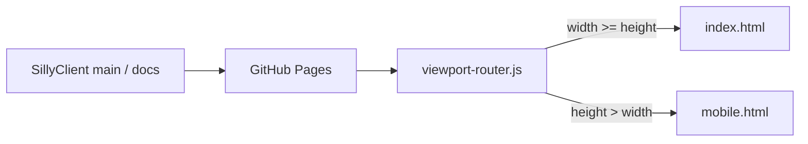
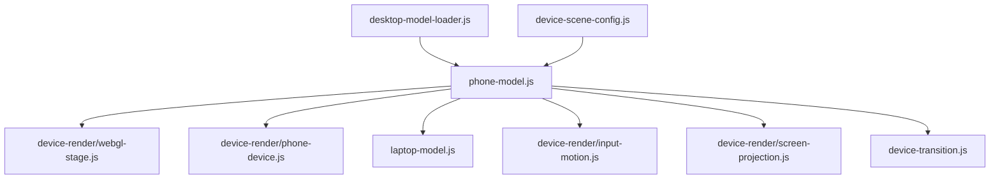
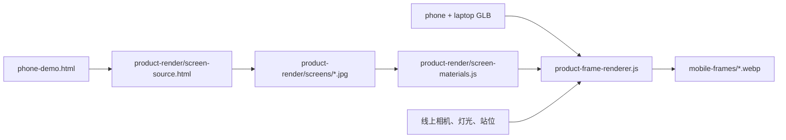

# Pages 维护手册

本文说明 SillyClient 项目主页的运行边界、模块依赖、资产更新和发布验收。它面向后续
维护者，不记录设计迭代历史。

## 1. 发布模型

GitHub Pages 直接发布主仓库 `main` 分支的 `docs/` 目录。没有单独的网页仓库，
也没有构建服务器在发布时重新生成资源。因此，浏览器需要的 HTML、CSS、JavaScript、
字体、GLB、屏幕纹理和移动产品帧都必须随主仓库提交。



`landing-3d-v2.html` 只负责旧链接兼容。新增功能进入 `index.html` 或
`mobile.html`，不要继续扩展旧入口。

## 2. 运行分层

页面分成五层，依赖只允许从外向内装配：

| 层 | 主要目录 | 职责 |
| --- | --- | --- |
| 入口 | `index.html`、`mobile.html` | 页面结构、资源加载顺序、无脚本兜底 |
| 页面 | `scripts/page/`、`mobile/scripts/` | 内容、语言、导航和页面状态 |
| 视觉 | `styles/`、`scripts/background/` | 排版、主题、玻璃材质、背景和文字效果 |
| 设备 | `scripts/device-render/`、`laptop-model.js` | Three.js 舞台、模型、投影和输入 |
| 资产 | `product-render/`、`scripts/product-render/` | HTML 屏幕纹理和移动产品帧 |

三个装配文件保持轻量：

- `scripts/page.js` 组装桌面内容、语言、导航、字体和检查器。
- `scripts/phone-model.js` 组装 Three.js 舞台、设备模型、转场和屏幕投影。
- `scripts/background.js` 延迟加载背景模块。

装配文件可以传递状态和生命周期，不应重新容纳大段样式、材质校准或页面文案。

## 3. 桌面入口

桌面页保留完整演示：

1. 第一页显示产品介绍和双设备开屏构图。
2. 第二页使用同一 Three.js 场景展示手机、电脑和双端协作三个状态。
3. 第三页使用横向项目卡片介绍共享前端、平台实现和发布结构。

### 页面模块

| 模块 | 文件 |
| --- | --- |
| 双语内容 | `scripts/page/content.js` |
| 组件说明数据 | `scripts/page/inspector-content.js` |
| 组件检查器 | `scripts/page/component-inspector.js` |
| 分页与输入 | `scripts/page/navigation-controller.js` |
| 第三页轮播 | `scripts/platform-carousel.js` |
| 标题字体 | `scripts/ui/title-font-controller.js` |

页面结构变化先修改 `index.html`，对应样式进入 `styles/page/` 或明确的视觉模块。
中英文文案键必须同时更新；验证脚本会检查缺失键和未使用键。

### 样式模块

`styles/page.css` 只导入以下分区：

- `page/base.css`：桌面画布、基础排版和共享组件。
- `page/journey.css`：第二页叙事与折叠内容。
- `page/platform.css`：第三页项目结构与卡片轨道。
- `page/inspector.css`：组件说明浮层。
- `page/responsive.css`：横屏桌面范围内的比例适配。

产品色板和材质变量统一放在 `styles/theme.css`。局部模块应引用变量，不要复制一套
相近颜色。

## 4. 设备舞台

桌面设备舞台只创建一个 WebGL canvas。手机和电脑 GLB 在同一场景、同一相机和同一
灯光系统中渲染。



### 场景数据

`device-scene-config.js` 是线上相机、设备姿态和三种展示状态的数值入口。
资产库中的 `SillyClient_Assets/models/blender/模拟场景.blend` 是视觉基准，
但不会复制到 Pages 仓库。调整站位时只提交换算后的场景数据和经过验证的 GLB。

### 屏幕投影

`phone-demo.html` 通过两个 iframe 分别提供手机和电脑比例的产品界面。
`screen-projection.js` 根据模型屏幕网格的世界坐标计算 CSS `matrix3d`，把 iframe
刚性绑定到设备屏幕。投影层不能使用独立漂移动画，也不能用宣传页截图代替前端。

电脑屏幕投影必须位于摄像头和屏幕边框之下。手机投影需要保留灵动岛安全区。

### 性能边界

- 桌面页按设备像素比设置渲染分辨率，并保留上限。
- 页面离开设备舞台后暂停无意义的屏幕投影更新。
- 用户启用 `prefers-reduced-motion` 时关闭非必要动效。
- 移动入口不加载 Three.js、GLB、iframe 或 GSAP。

## 5. 移动入口

移动页保留桌面页的主题、背景和三页内容结构，第二页不做实时 3D。三个设备状态由
`mobile/scripts/frame-stage.js` 切换：

| 状态 | 文件 |
| --- | --- |
| Android | `mobile-frames/android.webp` |
| Windows | `mobile-frames/windows.webp` |
| 双端 | `mobile-frames/together.webp` |

每张图为 `3840 × 2160`、带透明通道的 WebP。三张图总传输大小不得超过
256 KiB。移动入口开场先说明电脑端提供完整实时演示，轻触任意位置后进入页面；
这个提示不是按钮，也不响应滚动关闭。

移动页源码放在 `mobile/scripts/` 与 `mobile/styles/`，不要用桌面媒体查询继续堆叠
第二套页面逻辑。桌面和移动只共享稳定的视觉资源与
`ui/title-font-controller.js`。

## 6. 产品前端更新

共享 React 控制台的唯一源码位于：

```text
SillyClient_Android/web/capacitor-ui/
```

主仓库中的 `docs/app/` 和 `docs/phone-demo.html` 是生成物。产品前端变化时按以下顺序
更新：

1. 在 Android 仓库构建 `web/capacitor-ui/`。
2. 在主仓库运行
   `node scripts/sync-pages-app.mjs <capacitor-ui/dist>`。
3. 检查 `docs/app/` 和 `docs/phone-demo.html` 的差异。
4. 重新生成手机与电脑屏幕纹理。
5. 重新导出三张移动产品帧。
6. 运行页面验证，再提交主仓库。

同步脚本会修改资源路径、强制展示模式并设置默认安全区。不要手工把功能补丁写进
`docs/app/` 或 `phone-demo.html`，否则下一次同步会覆盖。

## 7. 屏幕纹理与产品帧

产品帧生成链路如下：



具体导出参数见 [`product-render/README.md`](./product-render/README.md)。
验收时页面根节点必须同时具有：

```text
data-product-render-ready="true"
data-product-screens="html-textured"
```

任何可见设备屏幕都必须显示当前产品前端。黑色占位屏、旧界面图片和宣传页截图都不
属于可发布资产。

## 8. 缓存与版本参数

GitHub Pages 没有应用构建步骤。修改已发布的 CSS 或 JavaScript 后，需要更新对应
HTML 或装配文件中的 `?v=` 参数。版本参数只用于浏览器缓存失效，不表达产品版本号。

同一批模块改动使用同一描述性标识，例如：

```text
?v=20260726-page-modules-v3
```

不要在没有文件变化时批量刷新所有参数，这会让审查失去重点。

## 9. 验收矩阵

每次发布至少完成以下检查：

| 范围 | 检查 |
| --- | --- |
| 路由 | 横屏进入桌面页，竖屏进入移动页，跨越 1:1 后正确切换 |
| 桌面 | 三页均可到达，第二页三个设备状态按顺序切换 |
| 模型 | 无穿模、无标志露出、电脑垂直展开状态正确 |
| 屏幕 | 手机和电脑均显示当前 HTML，投影不漂移、不遮盖边框 |
| 移动 | 不加载 Three.js/GLB/iframe，三张产品帧完整显示 |
| 内容 | 中英文键完整，标题字体轮换与提示正确 |
| 性能 | 无空白 canvas，无控制台错误，产品帧符合尺寸与体积预算 |
| 兼容 | `prefers-reduced-motion`、键盘导航和基本焦点状态可用 |

自动检查：

```bash
node scripts/validate-pages.mjs
git diff --check
```

自动检查不能替代浏览器视觉检查。尤其需要人工确认模型灯光、屏幕边缘、灵动岛安全区、
电脑摄像头层级和设备转场。

## 10. 发布

网页更改只提交到 `SillyClient` 主仓库。推送 `main` 后，GitHub Pages 会从
`docs/` 重新部署；Android 与 Windows 仓库无需为纯宣传页改动创建提交。

发布后检查：

1. GitHub Actions 中 `Quality` 通过。
2. `pages-build-deployment` 完成。
3. 线上根地址已经返回新提交。
4. 桌面和移动入口均能加载，静态资源没有 404。

页面发布不创建产品 Tag 或 Release。只有 APK、EXE 或产品版本变化时才执行
`release/RELEASE-GUIDE.md`。
